# 🚰 Smart Drainage Monitoring System

## 📌 Overview
The Smart Drainage Monitoring System is an AI-powered web application developed using Python and Streamlit. It helps monitor drainage conditions and predicts the risk level based on parameters such as water level, garbage level, rainfall, and flow rate. The system provides interactive dashboards, analytics, alerts, and reports to assist in proactive drainage management.

---

## ✨ Features
- 📊 Interactive Dashboard
- 📈 Analytics with Charts
- 🤖 Machine Learning-Based Risk Prediction
- 🚨 Alert System for High-Risk Areas
- 📄 Report Generation
- 💻 User-Friendly Streamlit Interface

---

## 🛠 Technologies Used
- Python
- Streamlit
- Pandas
- Scikit-learn
- Matplotlib
- Joblib
- Git & GitHub

---

## 📂 Project Structure

```
Smart_Drainage_Monitoring_System/
│
├── app.py
├── drainage_data.csv
├── drainage_model.pkl
├── requirements.txt
├── README.md
│
├── models/
│   └── train_model.py
│
├── pages/
│   ├── dashboard.py
│   ├── analytics.py
│   ├── prediction.py
│   ├── alerts.py
│   └── reports.py
│
├── screenshots/
```


---
## 📷 Application Screenshots

##  🏠 Homepage
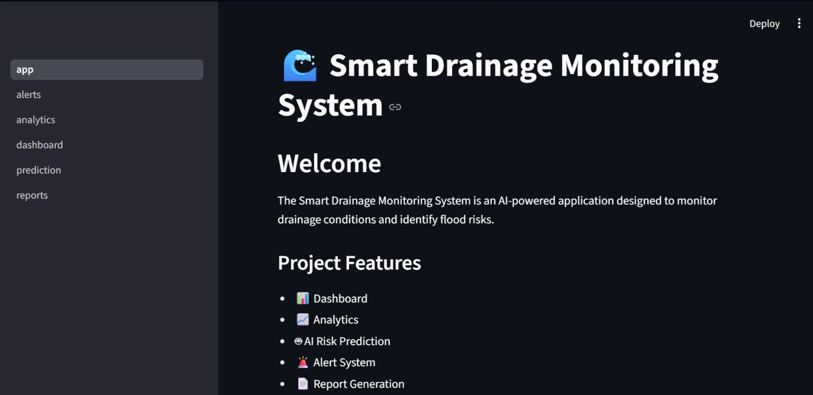

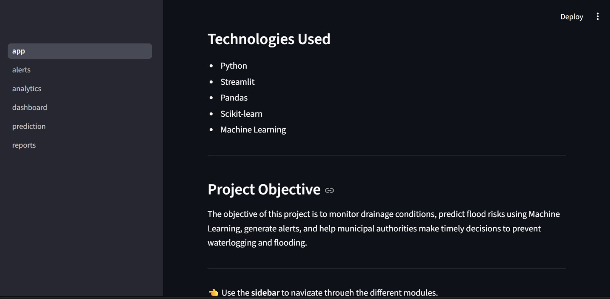

### 📊 Dashboard

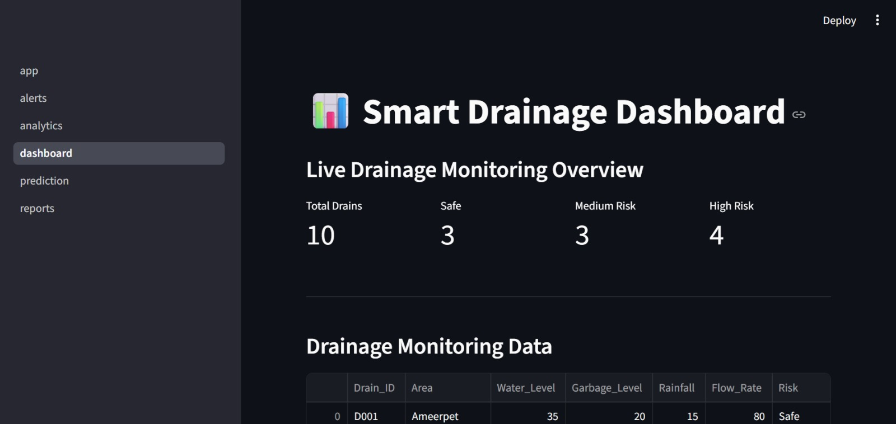

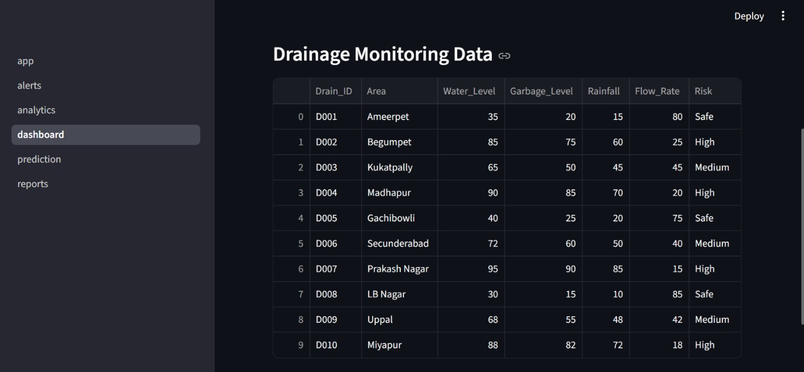

### 📊 Analytics
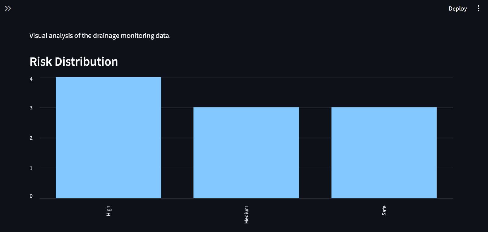

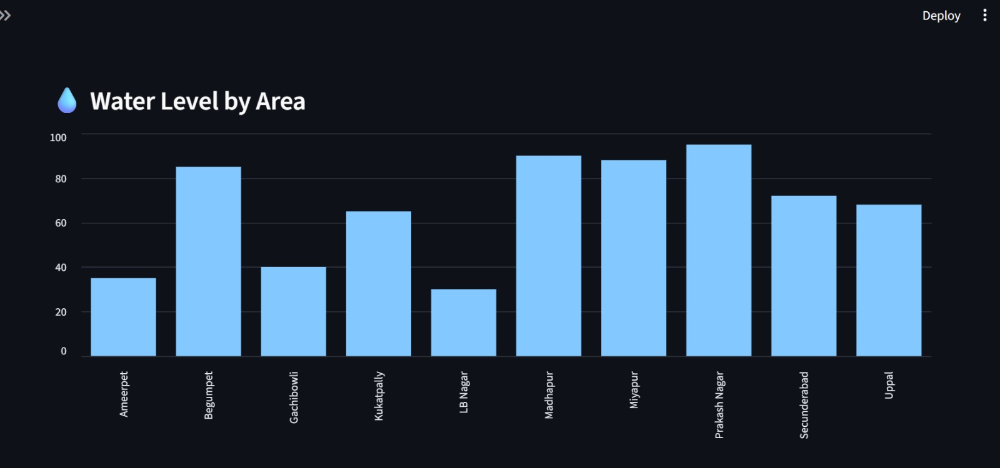

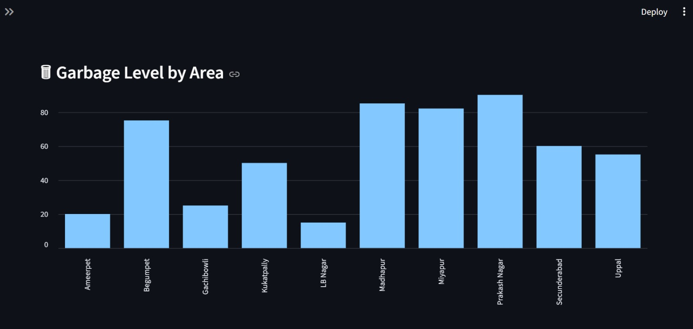

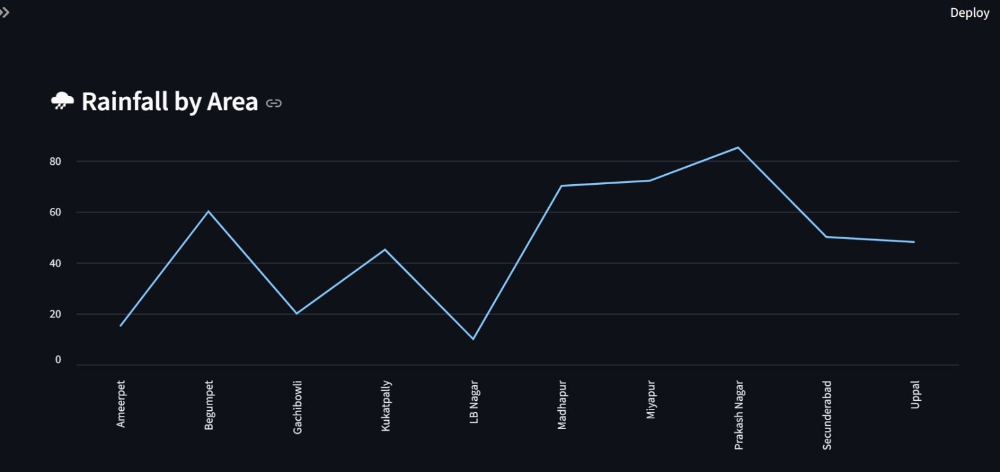

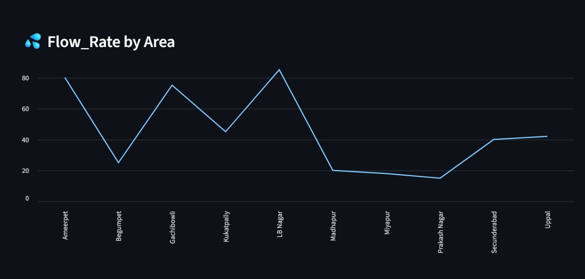


### 🤖 Prediction
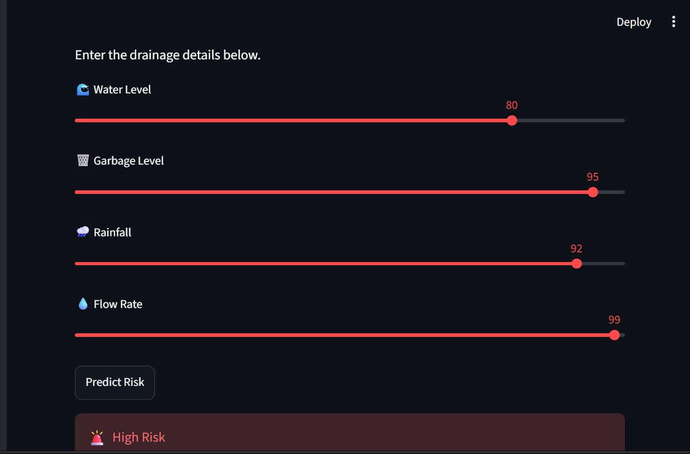

### 🚨 Alerts

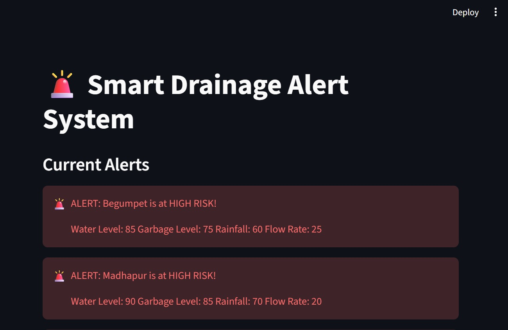

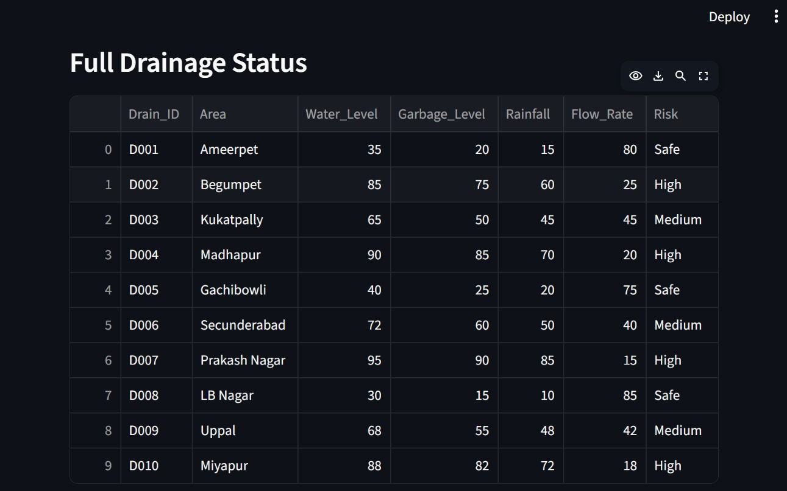

### 📄 Reports
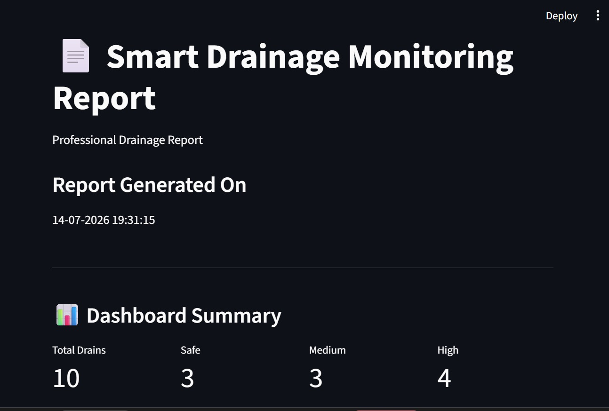

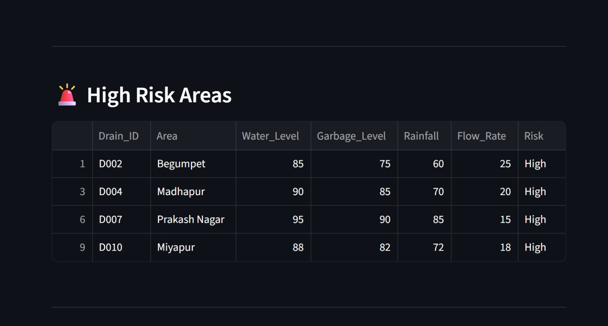

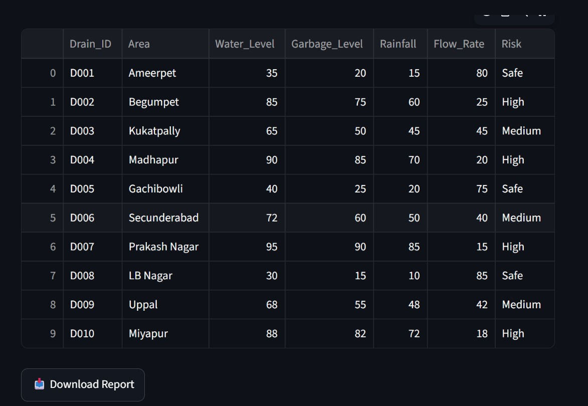

## 🚀 Installation

1. Clone the repository

```bash
git clone https://github.com/khariniharini6-H/Smart_Drainage_Monitoring_System.git
```

2. Open the project

```bash
cd Smart_Drainage_Monitoring_System
```

3. Install dependencies

```bash
pip install -r requirements.txt
```

4. Run the application

```bash
streamlit run app.py
```

---

GitHub: https://github.com/khariniharini6-H
